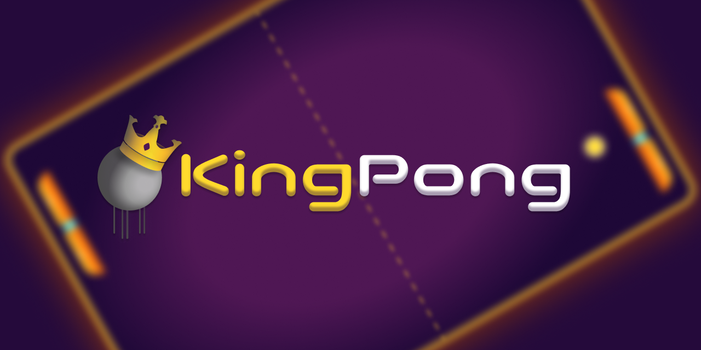

# KingPong


KingPong is a full-stack Pong game web application that brings the classic arcade experience to the modern web. With a seamless integration of Next.js, Nest.js, PostgreSQL (with Prisma), Nginx, Minio, and Docker, KingPong delivers a feature-rich environment for users to enjoy and compete.

## Features

### 1. User Accounts
KingPong supports multiple authentication methods, including normal account creation, Google sign-in, and 42 intranet login. Choose the method that suits you best and start playing!

### 2. Pong Game
Enjoy the classic Pong game with a twist. KingPong offers both normal mode and an exciting obstacle mode to challenge your skills. Whether you're a casual player or a Pong enthusiast, there's something for everyone.

### 3. Real-time Chat Interface
Connect with other players in real-time through the built-in chat interface. Discuss strategies, challenge opponents, or simply share your love for Pong with the community.

### 4. User Profiles
Customize your profile to showcase your achievements, game statistics, and personal preferences. Keep track of your progress and let others know about your Pong prowess.

### 5. Achievements
Earn achievements as you progress through the game. Whether it's a high score, a winning streak, or mastering the obstacle mode, KingPong recognizes and rewards your accomplishments.

## Technologies Used

- **Frontend:** Next.js 13
- **Backend:** Nest.js
- **Database:** PostgreSQL with Prisma
- **Reverse Proxy:** Nginx
- **Static Object Storage:** Minio
- **Containerization:** Docker

## Getting Started

### Prerequisites

Make sure you have the following installed:

- [Docker](https://www.docker.com/get-started)
- [Docker Compose](https://docs.docker.com/compose/install/)

### Running the Application

1. Clone the repository:

```bash
git clone https://github.com/your-username/KingPong.git
cd KingPong
```
2. Create a *.env* file in the root directory and configure the necessary environment variables. Refer to the provided .env.example for guidance.
3. Build and run the application using Docker Compose:

```bash
docker-compose up --build
```
4. Access KingPong in your browser at [http://localhost:8080](http://localhost:8080).

Start playing and relive the excitement of Pong with KingPong! If you encounter any issues or have suggestions, don't hesitate to reach out. Happy gaming!
